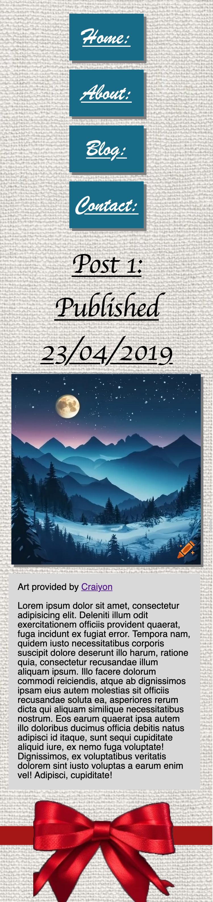

# Michael Bartel Portfolio

### <u>Links:</u>
[Website Link](https://portfolio-henna-three-68.vercel.app/)

[Project Repository](https://github.com/Caxhimel/Portfolio)

### <u>Purpose:</u>
This website was produced to provide:

 1. A demonstration of skills
 2. General information about me
 3. Contact details

### <u>Features and functionality:</u>

 1. Navigation links
 2. Mouseover elements for interactivity where supported
 3. Responsive design for use across multiple device sizes
 2. A consistent visual theme
 3. Beautiful AI generated art in blog (provided by Craiyon)

 ### <u>Target Audience:</u>
 1. Employers
 2. Other developers

### <u>Site map:</u>

### <u>Screenshots:</u>
#### Desktop

#### Tablet

#### Phone

### <u>Tech Stack:</ul>

 - HTML5
 - CSS3
 - Vercel